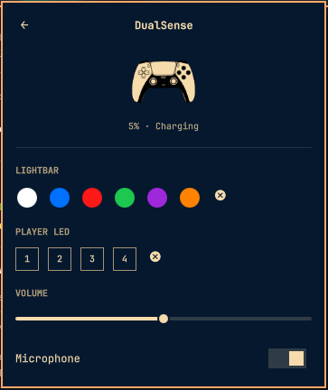
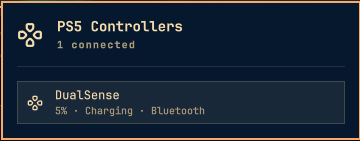

# PS5 Controller

An Omarchy bar widget for Sony DualSense controllers, built on top of
[`dualsensectl`](https://github.com/nowrep/dualsensectl). The bar icon shows
whether a controller is connected; the panel lists every connected DualSense
with its battery level and gives each one a control page for lightbar colour,
player-LED number, headset volume, and microphone mute.

<p align="center">
  
</p>

## Features

- Bar icon dims when no DualSense is connected and lights up when one is; the
  connected count shows in the panel header.
- Left click opens a panel listing every connected controller with its
  battery level and connection type (USB or Bluetooth). Right click forces a
  refresh.
- Click a controller to open its control page: lightbar colour presets and
  on/off, player-LED number (1&ndash;4), headset volume, and microphone mute.
- Keyboard friendly inside the panel: arrow keys move the cursor, Enter opens
  a controller, `r` refreshes, Esc / Tab behave like every other Omarchy
  panel.
- Polls through a small queue so two `dualsensectl` processes never touch the
  same hidraw device at once, with a watchdog that clears a hung call instead
  of stalling every later poll.

<p align="center">
  
</p>

## Requirements

- [`dualsensectl`](https://github.com/nowrep/dualsensectl) on your `PATH`.
  When it is missing the widget still loads and simply reports
  &ldquo;dualsensectl not found&rdquo;.
- A udev rule granting your user access to the controller&rsquo;s `hidraw`
  device (see the `dualsensectl` README). Without it `dualsensectl` runs but
  every command fails with a permission error.

## Install

```bash
omarchy plugin add https://github.com/androdesu/omarchy-ps5-controller-plugin.git --enable
```

`--enable` places the icon on the bar&rsquo;s right section. To move it later:

```bash
omarchy bar move androkami.ps5-controller --section right
```

Changes saved under `~/.config/omarchy/plugins/` reload automatically; force a
rescan with `omarchy-shell shell rescanPlugins` if one does not pick up.

## Configure

| Key | Default | Range | What it does |
| --- | --- | --- | --- |
| `refreshIntervalSec` | `5` | `2`&ndash;`60` | How often the controller list and battery levels are polled. |

```bash
omarchy bar set androkami.ps5-controller refreshIntervalSec 10 --json
```

## What it touches

Omarchy plugins run unsandboxed in the shell, so here is the complete list of
external interaction:

| | |
| --- | --- |
| Runs | `which dualsensectl` once to detect the tool |
| | `dualsensectl -l` on the refresh timer to list controllers |
| | `dualsensectl -d <serial> battery` once per discovered controller |
| | `dualsensectl -d <serial> lightbar\|player-leds\|volume\|microphone <args>` only in response to a click on the control page |
| Reads | Only this widget&rsquo;s own bar settings. No `/sys`, `/proc`, or files on disk. |
| Writes | Nothing. No state files, no configuration changes. |
| Network | None. |

No daemons, installers, remote builds, or privilege escalation. `dualsensectl`
is the sole external dependency.

## Limitations

- `dualsensectl` only has *setters* for volume and microphone mute &mdash;
  there is no way to read the controller&rsquo;s current values back, so the
  volume slider and mic toggle reflect only what was last set from this
  panel, not the controller&rsquo;s actual state.
- Battery level is reported by `dualsensectl` in 10% steps, so the panel
  shows `0, 10, 20 … 100`, never a precise percentage.
- The widget only ever sees controllers that are already connected;
  `dualsensectl` does not expose paired-but-offline devices.

## Assets

- The bar icon, list header, and per-controller rows use a plain
  [Lucide](https://lucide.dev) &ldquo;gamepad-directional&rdquo; glyph
  (`assets/arrow-pad.svg`), recoloured to the bar foreground.
- The control page&rsquo;s hero image (`assets/ps5-controller-gamepad.svg`) is
  an original hand-drawn DualSense illustration. It carries no PlayStation
  logo or ✕ ○ □ △ face-button glyphs, which are Sony trademarks.

&ldquo;PlayStation&rdquo; and &ldquo;DualSense&rdquo; are trademarks of Sony
Interactive Entertainment. This is an unofficial community plugin with no
affiliation with or endorsement by Sony, referenced only to identify the
hardware it controls.

## Remove

```bash
omarchy plugin remove androkami.ps5-controller
```

Removes the widget from the bar and deletes the plugin folder. The widget
writes no state, so nothing else is left behind.

## Development

```bash
omarchy plugin validate .
```

`Model.js` holds all of the parsing and formatting as pure functions with no
QML imports, so it can be exercised under `node` without a compositor.

## License

[MIT](LICENSE) © 2026 androkami
